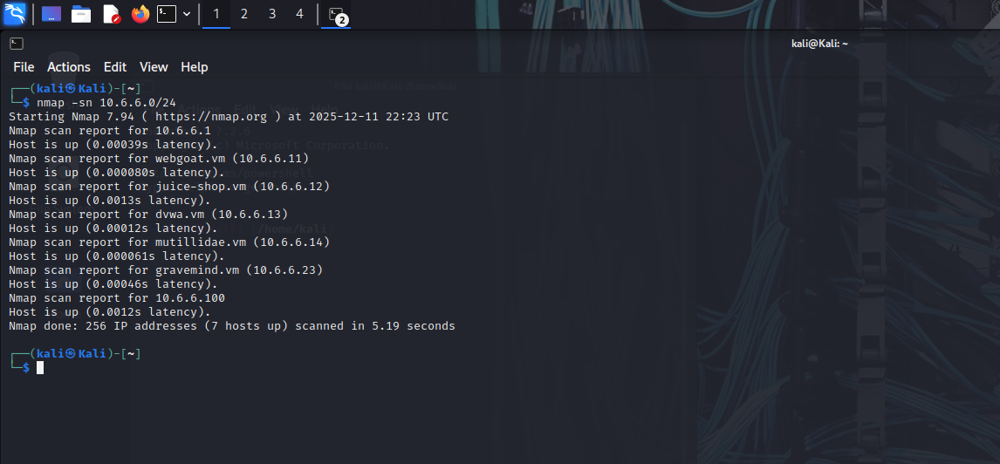

# Nmap Practical Lab Documentation
This folder contains all Nmap scans replicated from the classroom practical session, including screenshots, summaries, and explanations of each command.

1. Host Discovery Scan Command: nmap -sn 10.6.6.0/24 Purpose: Performs a ping sweep to identify active hosts in the subnet.
Screenshot:

