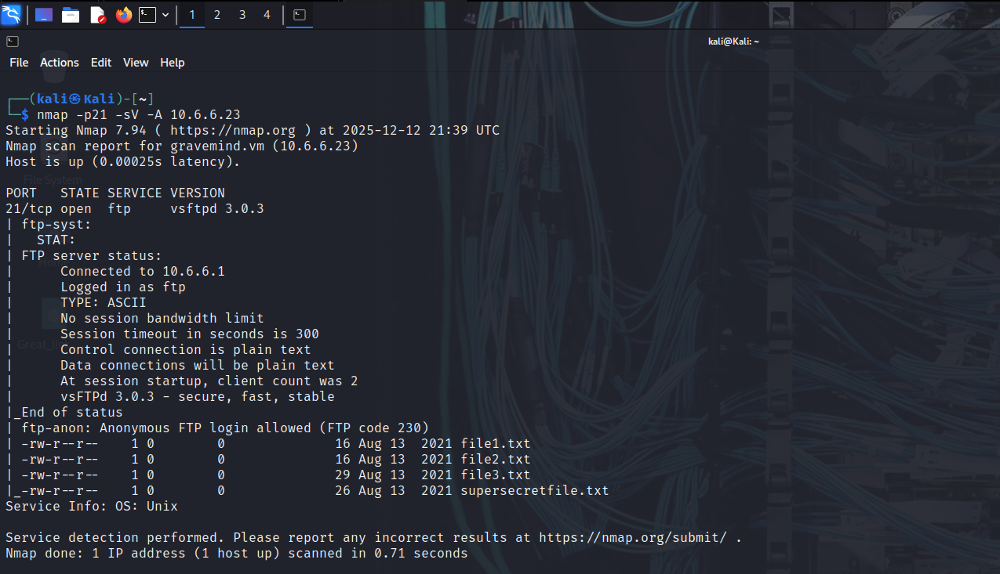
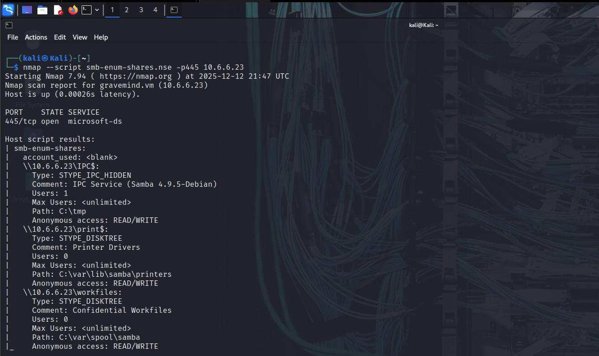

# Nmap Practical Lab Documentation
This folder contains all Nmap scans replicated from the classroom practical session, including screenshots, summaries, and explanations of each command.

1. Host Discovery Scan Command: nmap -sn 10.6.6.0/24 Purpose: Performs a ping sweep to identify active hosts in the subnet.
   Screenshot:

2. OS Fingerprinting Command: sudo nmap -O 10.6.6.23 Purpose: Identifies operating system using stack fingerprinting.
   screenshot:

3. Service Detection + Aggressive Scan Command: nmap -p21 -sV -A -T4 10.6.6.23 Purpose: Detects services, versions, OS, traceroute, and runs scripts.
   screenshot:

4. SMB Ports Scan Command: nmap -A p139, p445 10.6.6.23 Purpose: Scans SMB services on ports 139 and 445.

5. SMB Shares Enumeration Command: nmap --script smb-enum-shares.nse -p445 10.6.6.23 Purpose: Lists accessible SMB shares.

6. Manual Connection to SMB smbclient //10.6.6.23/print$ -N exit Purpose: Tests anonymous authentication to SMB share.

7. Network Information ifconfig ip route cat /etc/resolv.conf

8. Traffic Capture with tcpdump sudo tcpdump -i eth0 -s 0 -w ladies.pcap CTRL + C

9. Wireshark Review Open capture: wireshark

